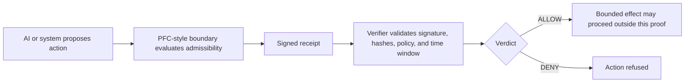

# PFC Execution Boundary Proof

[](https://github.com/danevans/pfc-execution-boundary-proof/actions/workflows/ci.yml)

Public proof surface for PFC-style execution-boundary governance and signed runtime admission receipts.

This repository demonstrates deterministic admission control before an action can bind consequence. It is intentionally narrow: no production adapters, no deployment authority, no network mutation, no credential access, and no proprietary PFC internals.

## Run locally in 60 seconds

```bash
python -m pip install -e .
python -m pytest -q
python -m pfc_boundary_proof.cli evaluate examples/ai_deploy_request.json > receipt.json
python -m pfc_boundary_proof.cli verify-receipt receipt.json examples/ai_deploy_request.json
python -m pfc_boundary_proof.cli replay receipt.json examples/ai_deploy_request.json examples/ai_deploy_request.json
```

## What this repo demonstrates

An AI system, agent, or automation layer proposes an action. The boundary evaluates the proposal against a policy snapshot, signs a receipt for the decision, and allows downstream verification before any bounded effect is attempted.

The core path is:

```text
proposal -> evaluation -> signed receipt -> verification -> bounded effect or refusal
```

The implementation proves:

- deterministic canonical JSON hashing
- default-deny policy evaluation
- Ed25519 signed receipts using demo-only fixture keys
- portable verification of payload, context, signature, and expiration
- replay verification against the original action and policy snapshot

## Architecture



## Execution-boundary model

The boundary is a runtime admission point. It evaluates a proposed action before the action is allowed to bind consequence.

Inputs:

- proposed action
- actor identity
- requested scope
- evidence
- context freshness
- immutable policy snapshot
- evaluation time window

Output:

- `ALLOW` or `DENY`
- deterministic reasons
- a signed receipt binding the decision to the action, actor, policy, context, payload, and time window

Default behavior is deny. An action is admitted only when the actor is authorized, the policy is valid, scope is valid, evidence is present, context is fresh, and the request is inside the configured time bounds.

## Why receipts are different from logs

“Receipt ≠ log entry.
A receipt is portable cryptographic proof that a specific action was admitted or refused under a defined policy, actor, context, and time window.”

| Model | Sequence | Decision point |
| :--- | :--- | :--- |
| Traditional agent systems | `proposal -> tool call -> logs` | After or during effect |
| PFC-style execution boundary | `proposal -> evaluation -> signed receipt -> verification -> bounded effect or refusal` | Before effect |

Logs describe what a system observed or recorded. A receipt is an admission artifact produced before effect. It is signed, portable, and independently verifiable.

## Sample signed receipt JSON

This is a deterministic example shape. The included key is a demo fixture and is unsafe for production use.

```json
{
  "action_id": "act-ai-deploy-001",
  "action_type": "deploy.preview",
  "actor_id": "agent:release-bot",
  "context_hash": "18ba33ca3bd13f453692159233bb008e5e85711940b2a3a49656fea6f2b057b1",
  "decision_id": "d3ff247b7328f10d424e0fcdc9250ba6994c27cfccde7f678fa0f6efb784a39f",
  "expires_at": "2026-05-24T12:06:00Z",
  "issued_at": "2026-05-24T12:01:00Z",
  "key_id": "demo-ed25519-unsafe-for-production",
  "payload_hash": "5f3ec000b11d50d8fda542965212588407eaf36a08c3489dc08ed3e7f47b912d",
  "policy_hash": "be8f55425f2c4480debabf06fa1a3584d1e624ef33905f570d5acccb51a5c778",
  "policy_id": "pfc-public-proof-policy",
  "policy_version": "2026-05-24.1",
  "reasons": ["request admitted"],
  "signature": "lFaiOYoMUvfRd3waPdsG6UZIZs69nEngXf/Jy7uPXNsEA5OYLTKE/cvVR6zdkQNq3Qhwy0QtKTueeodH7aJLAw==",
  "signature_algorithm": "Ed25519",
  "verdict": "ALLOW"
}
```

## What this proves

- A proposal can be evaluated before consequence.
- The decision can be bound to actor, policy, payload, context, and time.
- The receipt can be verified without trusting logs.
- Replay can detect payload, context, policy, signature, and expiration mismatch.
- The default path is deny unless all required predicates pass.

## What this does not prove

- Production authorization security.
- Deployment, payment, or infrastructure control.
- Credential handling.
- Network or Git safety controls.
- Completeness of any proprietary PFC system.

## Threat assumptions

This proof assumes an attacker may try to tamper with payloads, reuse receipts, submit stale context, drift scope, change policy snapshots, or act as an unauthorized principal. The verifier rejects those cases by recomputing canonical hashes, checking the receipt signature, enforcing expiration, and replaying the decision from the original inputs.

This proof does not claim to secure real production execution. It demonstrates the public, deterministic boundary pattern only.

## CLI examples

Evaluate a bounded deployment proposal:

```bash
python -m pfc_boundary_proof.cli evaluate examples/ai_deploy_request.json
```

Verify a receipt against the original action request:

```bash
python -m pfc_boundary_proof.cli verify-receipt receipt.json action.json
```

Replay the decision against the original action and policy snapshot:

```bash
python -m pfc_boundary_proof.cli replay receipt.json action.json policy.json
```

The example request files contain both an `action` and a `policy` snapshot. The replay command accepts either a plain policy snapshot or an example file containing a top-level `policy` object.

## Replay guarantees

Replay recomputes the decision from:

- original action
- policy snapshot
- receipt issue time

Replay fails if:

- payload hash changes
- context hash changes
- policy hash changes
- receipt signature is invalid
- receipt is expired
- recomputed verdict or reasons differ
- recomputed receipt fields do not match the signed receipt

## Safety constraints

- Demo-only Ed25519 fixture key, labeled unsafe for production.
- No credential loading.
- No network actions.
- No Git actions.
- No deployment, payment, or production adapters.
- No autonomous execution.
- No hidden authority.

## Non-goals

This repository is not a production authorization service, not a deployment controller, not an observability product, and not a post-hoc audit log. It is a compact engineering proof of admission-before-consequence governance.
